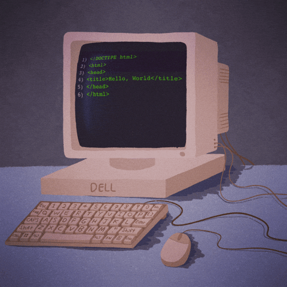

   
  

  ## My Skills

### Core & Back-end
&nbsp;
&nbsp;
&nbsp;

### Front-end
&nbsp;
&nbsp;

### Database

### Tools & Others
&nbsp;
&nbsp;
&nbsp;
&nbsp;

  ## Currently Learning
  &nbsp;
  

  ## Contact me
  &nbsp;
  &nbsp;
  

